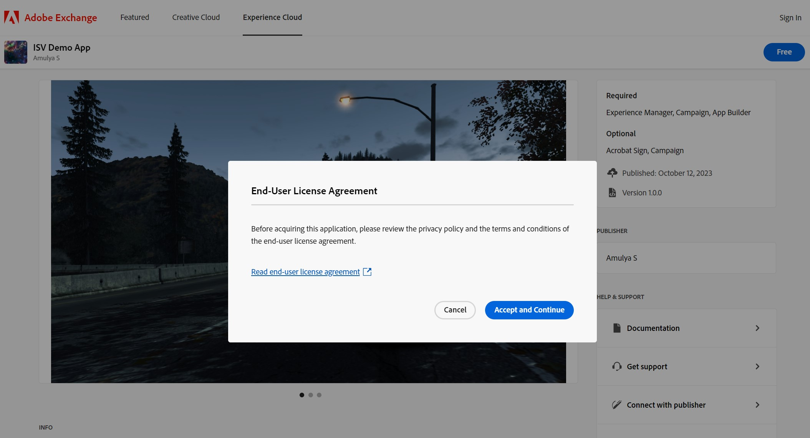
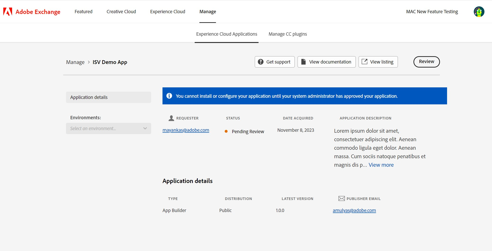

---
keywords:
  - Creative Cloud
  - Marketplace
  - Exchange
  - Distribution
  - Extensibility
  - SDK
  - Developer Tooling
  - UXP
  - Photoshop
  - XD
  - Plugin
  - JavaScript
  - Developer Console
  - Creative Cloud Desktop
  - FastSpring
title: Getting Started
description: This is the getting started page
---

<Hero slots="heading, text" background="rgb(141, 52, 78)"/>

# Discover, acquire & manage App Builder apps and software integrations

Customers can discover and manage their entitlements once acquired on [Adobe Exchange](https://exchange.adobe.com/apps/browse/ec).

Adobe Exchange detail pages will instruct enterprise customers on how to acquire software integrations directly from the developer. App Builder Apps can be acquired directly from the Adobe Exchange detail pages by enterprise users. From the **Manage** page, enterprise admins can Review/Approve or Revoke, install environment(s), choose product profiles & custom configurations, before deploying the App Builder app to the user.

 

## Discover

Published software integrations and App Builder apps will appear on [Adobe Exchange](https://exchange.adobe.com/apps/browse/ec). Apps can be discovered using keyword search, filter and sort. Users can also filter apps by partnership level developer. Below is an example of using App Builder as a search key word.  

Clicking on the name of an app listing will take the marketplace user to that app listing’s details page. The listing details page will show ‘App Builder’ as one of the Required products.

## Acquire

If, after viewing the application details, the user decides to acquire the app, they can click the ‘Free’ button on the top right. A modal will appear to confirm that the user’s organization has the required Adobe products.

Clicking ‘Yes, continue’ will display the link for the end-user license agreement provided by the developer of the app.

If the user clicks on the ‘Accept and continue’ button on the End-user license agreement, they will be taken to the sign-up-sign-in screen and required to login to the Exchange marketplace (if they aren’t already logged in). Once they log in, the app will be acquired for the org associated with their login credentials. The ‘Free’ button will be replaced by ‘Manage’, and the app will start showing as ‘Acquired’. Users will also see a confirmation modal informing them that the app has been acquired, and their system administrator must approve the acquisition before it can be deployed and used.

## Manage

Clicking ‘Manage’ on the app listing details page, or the ‘Manage your app’ button in the ‘Application acquired’ modal will open the Experience Cloud Applications tab on the ‘Manage’ page with a list of all acquired applications.

The user can also navigate to the Manage tab from the global navigation bar on the Exchange marketplace and click on the ‘Experience Cloud Applications’ tab to view a list of all acquired apps for their org. Admins logged into Adobe Exchange will additionally have the option to ‘Review’(approve) or ‘Revoke’ App Builder apps that have been acquired.

Clicking on any app’s name on the Experience Cloud Applications tab will open the application details page for that app, where the user will have the option to ‘Get support’ from the developer, ‘View documentation’ for the app, and ‘View listing’ on the Exchange marketplace. Their org admin will additionally see the option to ‘Review’ the app for their org.

Clicking on ‘Review’ will open the modal ‘Review this application’ with the app’s name and description. The system administrator will need to add notes to approve or reject the app for use.

If the system administrator rejects the app, the user will see the option to request for approval again on the application’s details page.

Clicking on ‘Request again’ will change the status of the app to ‘Pending review’. A request will then be sent to the system administrators of the organization to review the app. The user will be routed back to the Experience Cloud Applications tab with a success toast informing them that their request for review was sent successfully.

If the administrator approves the app, the status of the app will change to ‘Approved’. The administrators of the organization will start seeing the option to ‘Revoke’ the app on the application’s details page.

To deploy and start using an App Builder App, the administrator will need to add and install the required environment(s). Clicking ‘Add environment’, will open ‘name a new environment’ modal.

Upon creation of a new environment, the administrator will see a success toast on the application details page, and a message that the environments have been created for the application.

Clicking on the card of an environment will route the administrator to the details page for that environment. On the ‘Configuration’ tab, they will see the option to choose the custom configurations and product profiles for the environment before deploying the application. These custom configurations are provided by the app developer with the upload of the application’s package. Custom Configurations will vary from application to application, depending on the configurations needed for optimal functionality. See ["Custom Configurations tab"](./custom_configurations.md) to define user configuration options.

After choosing the configurations and product profiles, the administrator will be able to deploy the application. Upon clicking ‘Deploy’, a toast will let them know that deployment is underway and might take a few minutes.

On successful deployment of an environment, the status of that environment will change to ‘Deployed’. The option to ‘Delete environment’ will be disabled for the administrator. If they want to delete the environment, they will need to undeploy the environment first.

 ### Revoking an application
 
System administrator will see the option to ‘Revoke’ a deployed application on the Application details tab.

 On clicking ‘Revoke’, administrator will see a modal informing them that if they revoke the app, it’ll be uninstalled for everyone in their organization, and to reuse the application, they’ll need to go through the review cycle again. On clicking on the button ‘Revoke’ on the modal, all installations of the application will undeployed for the organization.

### Getting support for an application

An acquired application’s ‘Application details’ page will show the option to ‘Get support’. The option will show for an application that has been approved, rejected or revoked by the system administrator.
 

  
The modal auto-fills the email and name of the user, and they are asked for their company name. The support they require with the application can be shared in the open-text field ‘Message to publisher’. On clicking ‘Submit’. The user lands up on the ‘Application details’ page with a success toast informing them that an email was sent to the publisher of the application.

 