---
keywords:
  - Experience Cloud
  - Marketplace
  - Exchange
  - Distribution
  - Extensibility
  - SDK
  - Developer Tooling
  - UXP
  - Photoshop
  - XD
  - Plugin
  - JavaScript
  - Developer Console
  - Experience Cloud Desktop
  - FastSpring
title: Getting Started
description: This is the getting started page
---

# Getting Started

This getting started guide introduces key areas of the [Adobe Developer Distribution portal](/distribute/home) to help you begin distributing your plugins quickly and easily. The Adobe Developer Distribution portal enables you to quickly publish a **listing** for your plugin on two Experience Cloud Marketplaces; the Experience Cloud desktop app Marketplace and Adobe Exchange in these three easy steps:

1. Add your public profile.
2. Create a **listing** to represent your plugin with metadata, the packaged plugin, and a **version**.
3. Submit your **listing** for approval to be published immediately or at a date you choose.

<InlineAlert slots="text" variant="help"/>

A **listing** is what users see on a Marketplace. It contains metadata to describe your plugin and how to use it, along with a specific **version** of your plugin to be installed by the Experience Cloud desktop app. For more details on these concepts and how they are used in the distribution of your plugin, see the [Glossary](./glossary.md).

## Overview

The following section will provide a brief overview of each view in the [Adobe Developer Distribution portal](/distribute/home) to help you get started using it quickly. This applies to both App Builder and service-to-service applications. 

## Home

The home page is where developers create their public profile and create a new listing for their plugin. Here you will find "Quick start" links to create a new listing and edit or view your public profile. The "Get Started" box helps reminds developers that a profile must be created and submitted before any plugin can be submitted for approval.

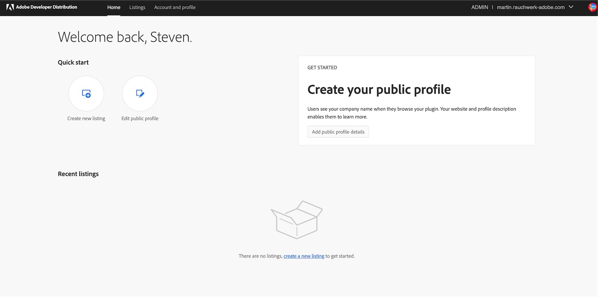

As listings are created, up to three of the most recent will be shown for quick view and access. As listings are published, an "Insights" summary table will replace the "Get Started" box. To manage more than three listings, choose the **All listings** link or the **Listings** tab in the nav bar to go to the "Your Listings" page.

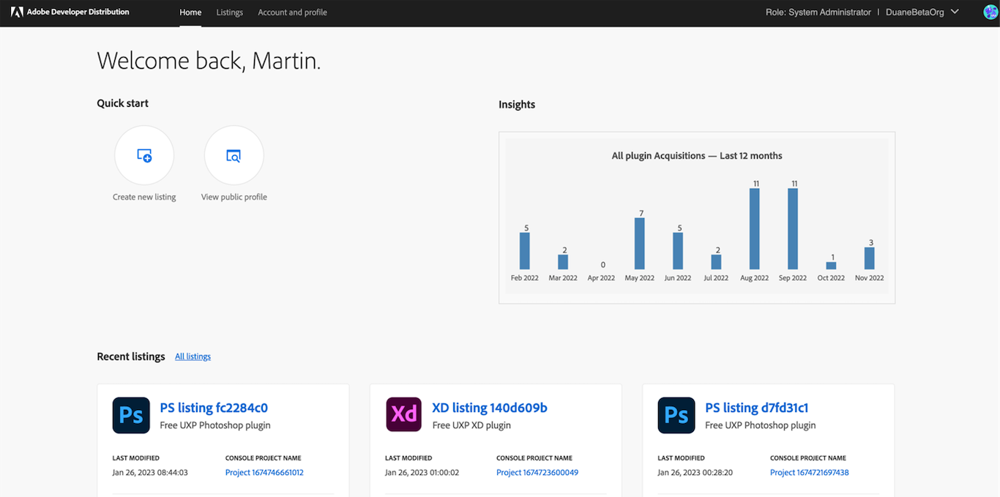

## Creating a Listing

Once you have built, tested, and packaged your app (using App Builder in the Adobe Developer Distribution portal), you can create a listing for the Marketplace. Executing the command "Distribute" will take you the Developer Console where you can create a listing for your app. 

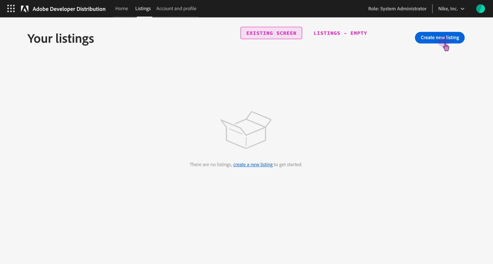

Chose a listing type, the last box is for software integrations.

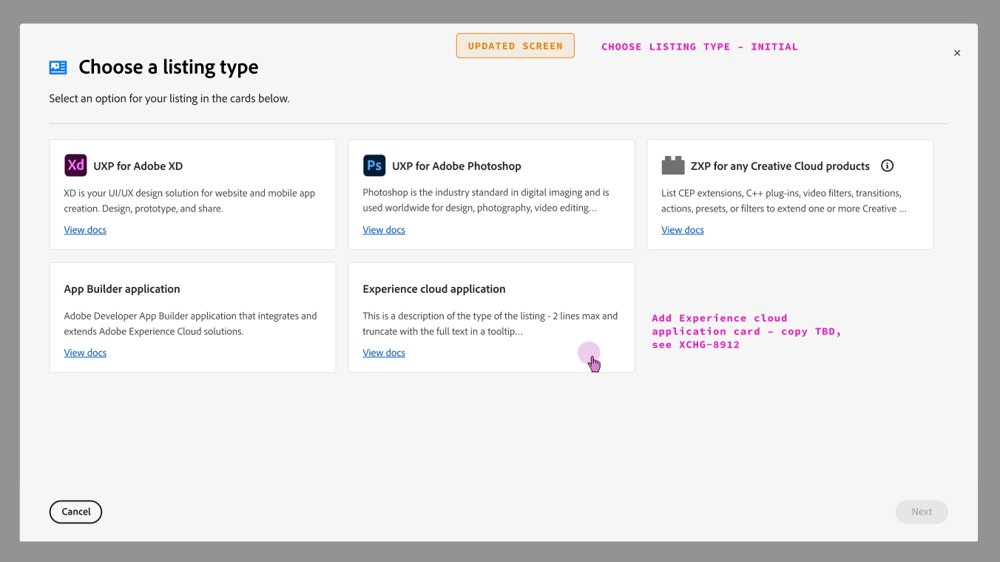

Once a listing is created, metadata can be entered from the listing details screen.

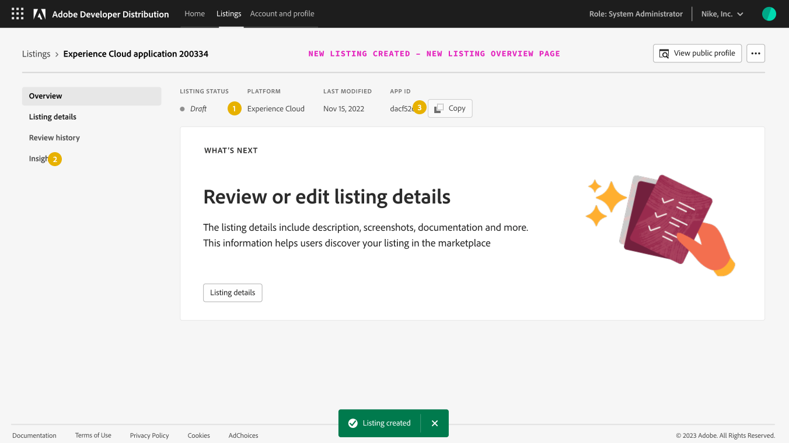

**New Submission** - You are now ready to create and submit your app. For your first submission, you must submit listing details and a new version together. After publishing, you can submit an update to the listing details or a new version independently from each other. 

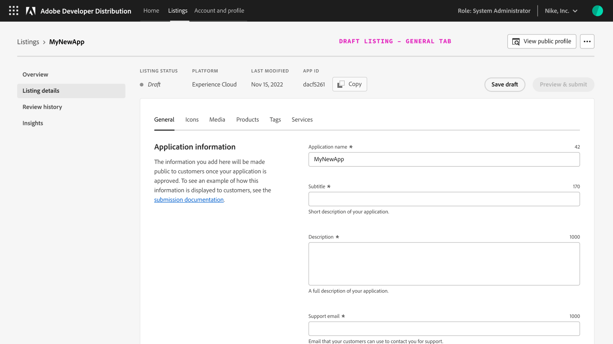

This is the landing page where you will create your submission. Before you get started, do the following: 

1. Look at the navigation panel on the left to confirm you are on the Listing Details screen.
2. In the upper right-hand corner, make sure your role and your organization's name are listed. If you need to edit any of your profile details, click the "Edit Public Profile" tab.
3. The menu at the top of the screen indicates your listing status, the platform you are using, the last modified date, and your APP ID. You are now ready to add the listing details for your app. 

### Listing Details

You will submit your app builder new listing metadata in multiple tabs: General, Icons, Media, Products, Tags, and Services. All mandatory fields are marked with an asterisk. Start on the General tab. This tab has Application name, a short description (subtitle), a long description, and support email.  Be sure to save a draft if you navigate away from the page.

Three different icon sizes are required for each integration as well as a Featured image for featuring an integration.

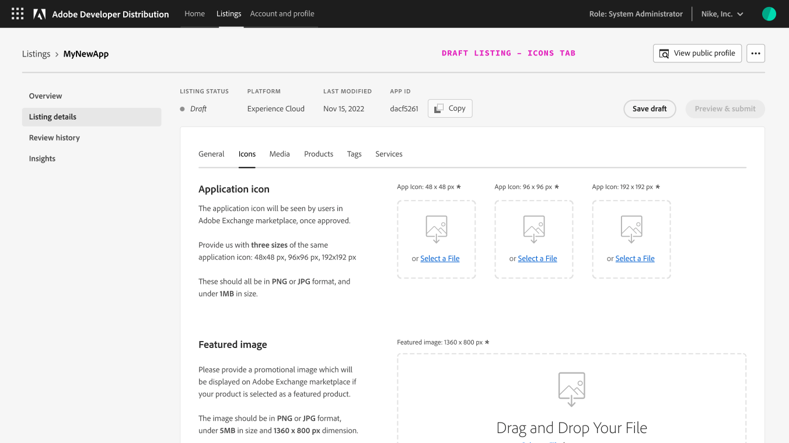

You can use 4-10 screenshots to describe the integration. Up to 10 documents (such as white papers) can be uploaded.

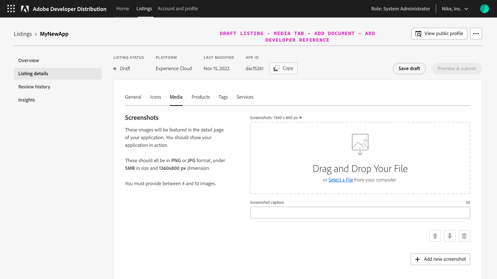

The Products tab is for choosing which Adobe Experience Cloud products are required and/or optional for a software integration.

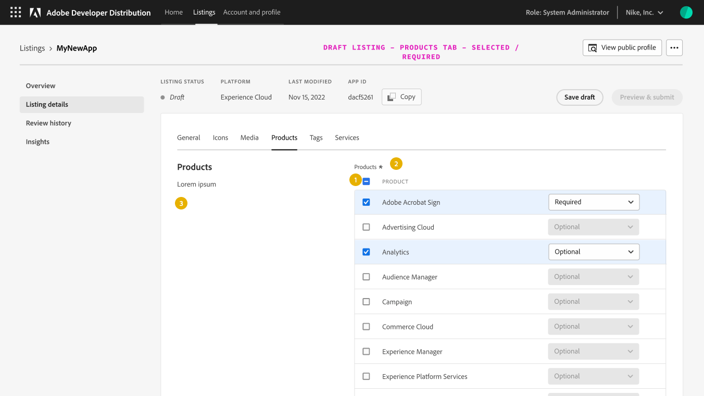

Categories and tags help customers discover and filter/sort software integrations published on the Experience Cloud Exchange Marketplace.

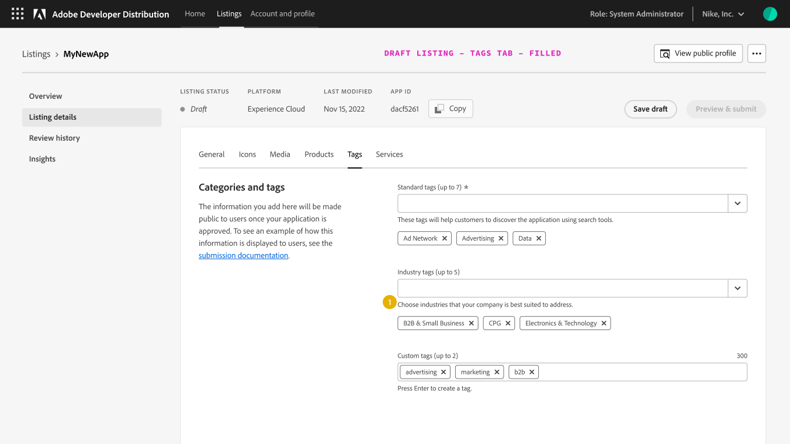

The Services tab is for entering an optional End-User License Agreement and installation instructions.  Instruction templates are available for some Experience Cloud products.  An optional software revision number, release notes and supported languages can also be provided on the Services Tab.

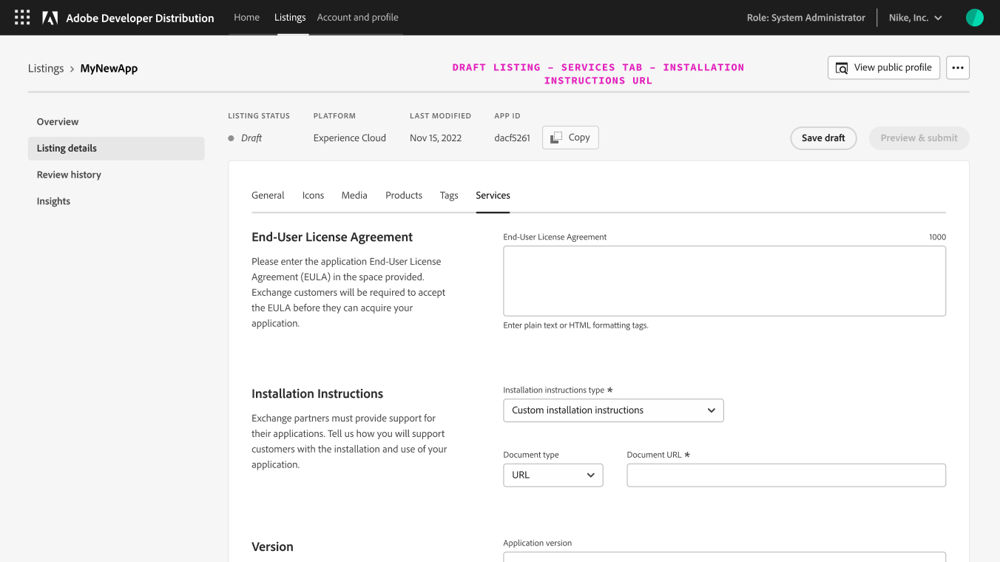

When you've finished adding all the listing details and completing the mandatory fields, the Preview and Submit button will be enableed. When you click the button, you will see a marketplace preview from the submission modal or checklist. Once a note is provided to a reviewer the Submit for review button will be available.

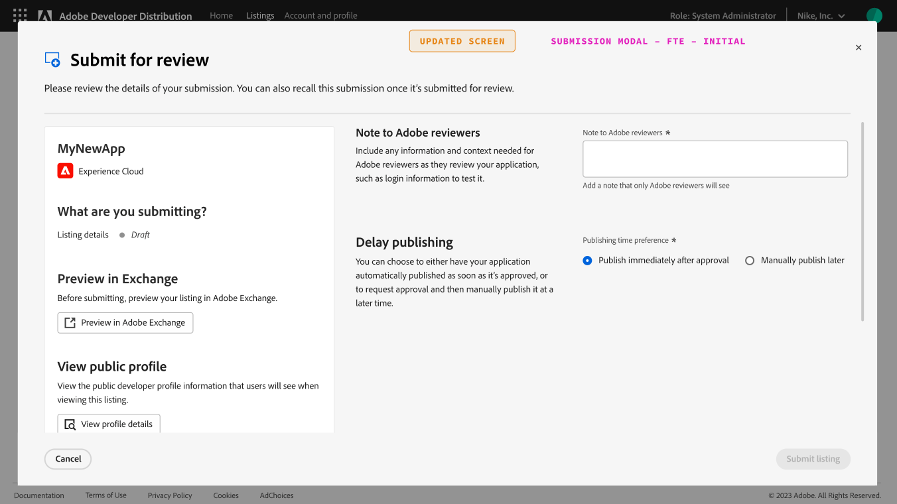

After your listing is submitted, you will see a confirmation on the listing overview screen. Note the status of the Listing changes from draft to “In review."

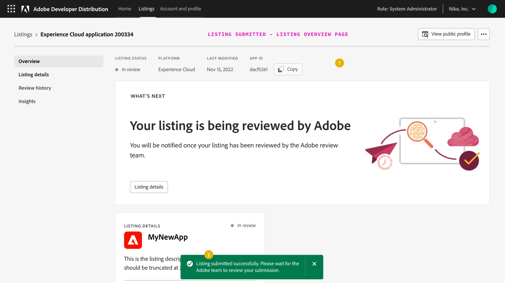

You will be notified by email when your listing has been approved and published on the marketplace. Listing details can be edited on a published listing. Metadata edits are highlighted by a yellow outline and the status has an edit suffix.  Edits can be submitted for review and will take effect immediately upon approval. Note the edit suffix on the submission modal and the fact that Delayed publishing is disabled for metadata changes to a published listing.

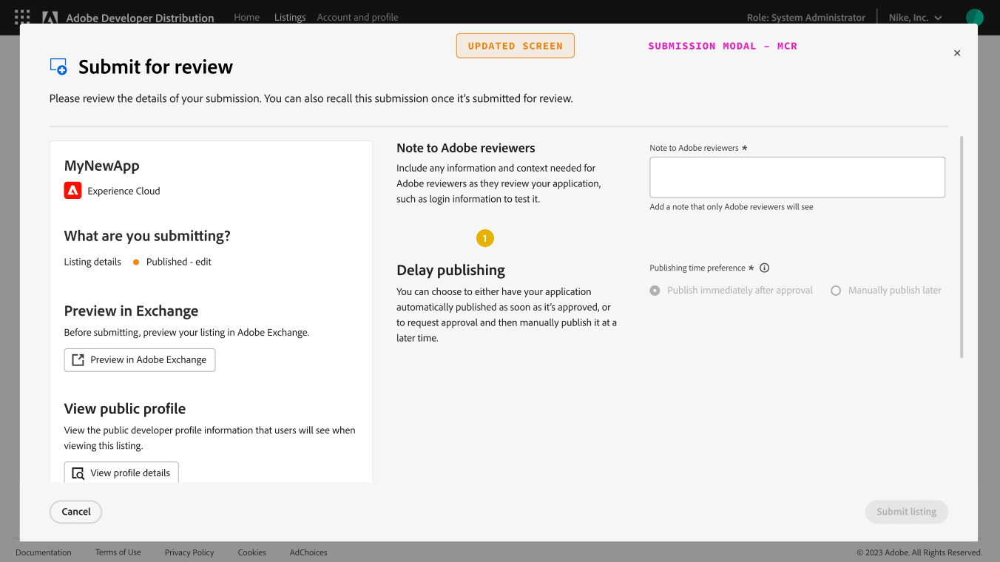

### Reviewing A Submission

When an application has been submitted for review, an Adobe administrator will review the application details. 

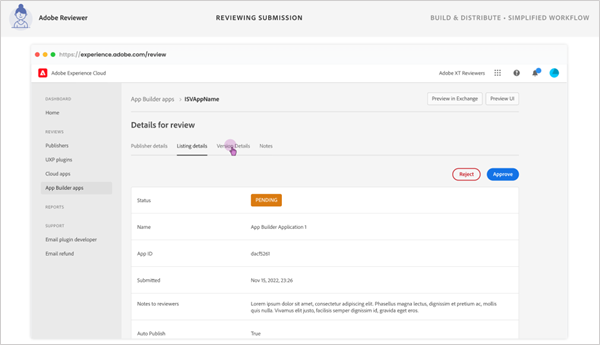

If all the information is complete and the requirements are met, the reviewer will approve the submission. 

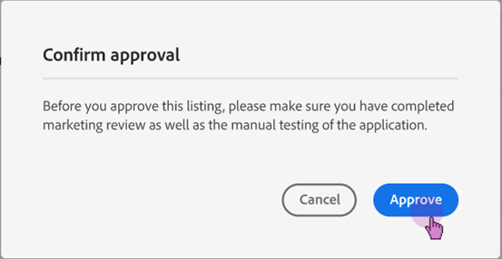

The status of the submission will show a green "APPROVED" button. 

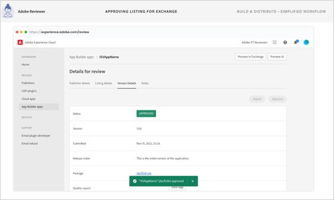

### Revision

NOTE from CHANTA: Martin, I'm not sure what content to add here. Is there where instructions go for the developer to edit a listing? 

### Manage Screen 

CHANTA: Still working on this section-PROBABLY need to add the admin steps from Veronica's screenshots. 

To check the status of your submission, go to the Manage tab and look to see if there is an approval message near the bottom of the screen. Then follow the instructions to add a new environment to start installing your application. If it is approved, you will see the following notification. 

CHANTA: ADD SCREENSHOT OF APPBUILDER App_Approval HERE. 

If it is not approved or it is in pending status, you will see the following notification: 

CHANTA: ADD SCREENSHOT HERE. 

Once you have created your new environment, click the blue Deploy tab. CHANTA: I DON'T KNOW IF THIS IS CORRECT. 

CHANTA: ADD SCREENSHOT OF APPBUILDER Deploy HERE. 

