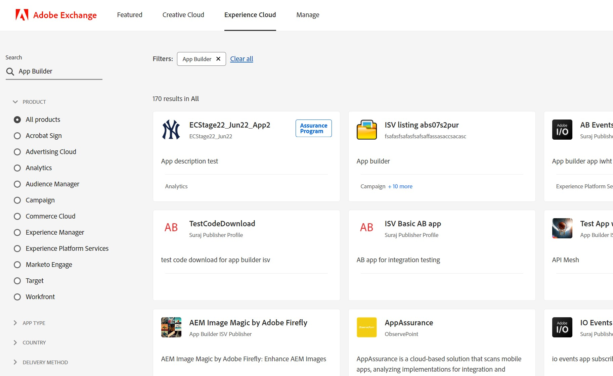
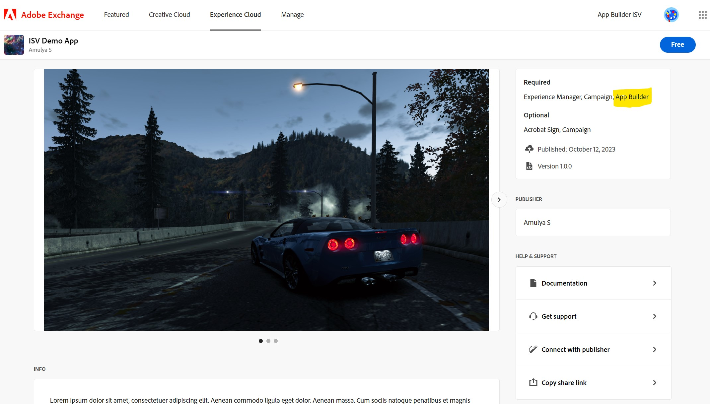
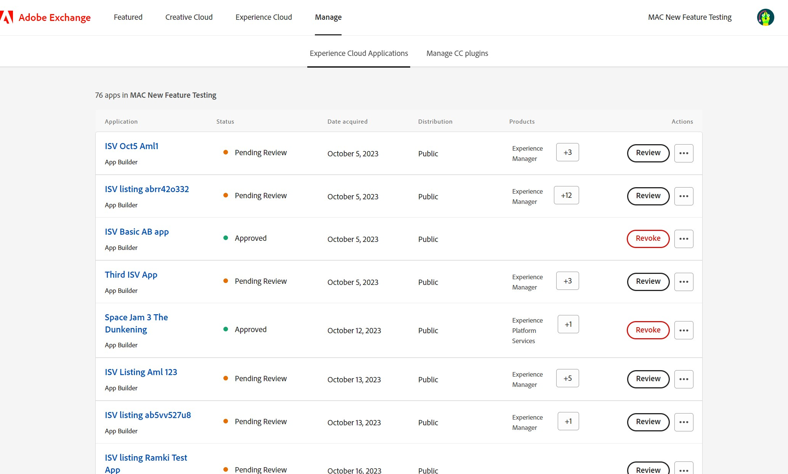
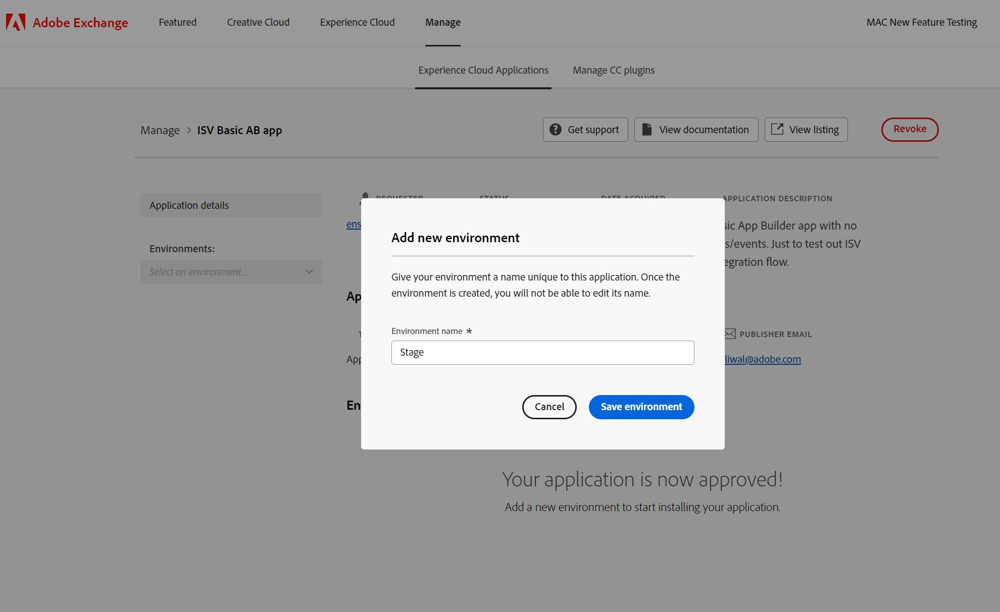

---
keywords:
  - Creative Cloud
  - Marketplace
  - Exchange
  - Distribution
  - Extensibility
  - SDK
  - Developer Tooling
  - UXP
  - Photoshop
  - XD
  - Plugin
  - JavaScript
  - Developer Console
  - Creative Cloud Desktop
  - FastSpring
title: Getting Started
description: This is the getting started page
---

# Manage Entitlements

MARTIN TO CREATE INTRO SENTENCE HERE. These instructions help developers manage their application details once their app has been approved and published to the marketplace:

## App discovery and acquisition on Exchange marketplace (Manage screen) 

Published App Builder apps start showing up on the Exchange marketplace in the Experience Cloud browse page. The App Builder app can be discovered by using keyword search and filters, such as Adobe products, the app extension, industry, and country. Users can also filter apps by partnership level of the app publishers. 

Clicking on the name of an app listing will take the marketplace user to that app listing’s details page. The listing details page will show ‘App Builder’ as one of the Required products.

If, after viewing the application details, the user decides to acquire the app, they can click the ‘Free’ button on the top right. This will open a window informing them about which Adobe products their organization should have in order for the app to function as intended.   

Clicking ‘Yes, continue’ will display the link for the end-user license agreement provided by the developer of the app. 

If the user clicks on the ‘Accept and continue’ button on the End-user license agreement, they will be taken to the sign-up-sign-in screen and required to login to the Exchange marketplace (if they aren’t already logged in). Once they log in, the app will be acquired for the org that they are logged in to. The ‘Free’ button will be replaced by ‘Manage’, and the app will start showing as ‘Acquired’. Users will also see a confirmation informing them that the app has been acquired, and the system administrator of their org needs to approve the acquisition before it can be installed and used. 

Clicking ‘Manage’ on the app listing details page, or the ‘Manage your app’ button will route the user to the tab Experience Cloud Applications tab on the ‘Manage’ page, where the application details page for that app will appear.  

The user can also navigate to the Manage tab from the global navigation bar on the Exchange marketplace and click on the ‘Experience Cloud Applications’ tab to view all apps acquired for their org. Admins will also see the option to ‘Review’ for apps that have been acquired, but not approved yet. 

Clicking on an app’s name on the Experience Cloud Applications tab will take the user to the application details page for that app, where the user will see the options to ‘Get support’ from the developer, ‘View documentation’ for the app, and ‘View listing’ on the Exchange marketplace. The system administrator will also see the option to ‘Review’ the app for their org.  

Clicking on ‘Review’ will open the modal ‘Review this application’ with the app’s name and description. The system administrator will need to add notes to approve or reject the app for use. 

If the system administrator rejects the app, the user will see the option to request for approval again on the application’s details page. 

Clicking on ‘Request again’ will change the status of the app to ‘Pending review’. A request will then be sent to the system administrators of the organization to review the app. The user will be routed back to the Experience Cloud Applications tab with a success toast informing them that their request for review was sent successfully. 

If the administrator approved the app, the status of the app will change to ‘Approved’. The administrators of the organization will start seeing the option to ‘Revoke’ the app on the application’s details page.  

For the users in the organization to start using the application, the administrator will need to add and install environments that they need. Clicking ‘Add environment’, the administrator will see the modal to name a new environment and save it. 

Upon creation of a new environment, the administrator will see a success toast on the application details page, and a message that the environments have been created for the application. 

Clicking on the card of an environment will route the administrator to the details page for that environment. On the ‘Configuration’ tab, they will see the option to choose the custom configurations and product profiles for the environment before deploying the application. These custom configurations are provided by the developer of the applications while uploading the application’s package on Developer Distribution. So, they will vary from application to application, depending on the configurations that the developer needs for their application to function optimally. 

After choosing the configurations and product profiles, the administrator will be able to deploy the application. Upon clicking ‘Deploy’, a toast will let them know that deployment is underway and might take a few minutes. 

