---
keywords:
  - Creative Cloud
  - Marketplace
  - Exchange
  - Distribution
  - Extensibility
  - SDK
  - Developer Tooling
  - UXP
  - Photoshop
  - XD
  - Plugin
  - JavaScript
  - Developer Console
  - Creative Cloud Desktop
  - FastSpring
title: Service to Service
description: This is the service to service page
---

# Software Integration

The following screenshots explain the creation and submission of a Software integration listing for Adobe review.

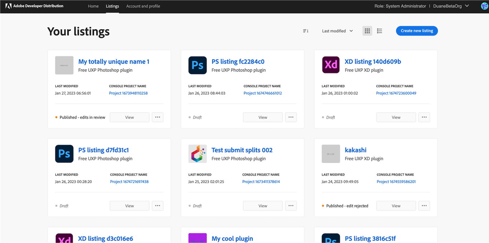

## Creating a Listing

A new listing can be created from the home page or the “Your listings” page. Clicking on ‘Create a new listing’ lands the developer on the modal overlay where they must choose the type of listing they want to create.

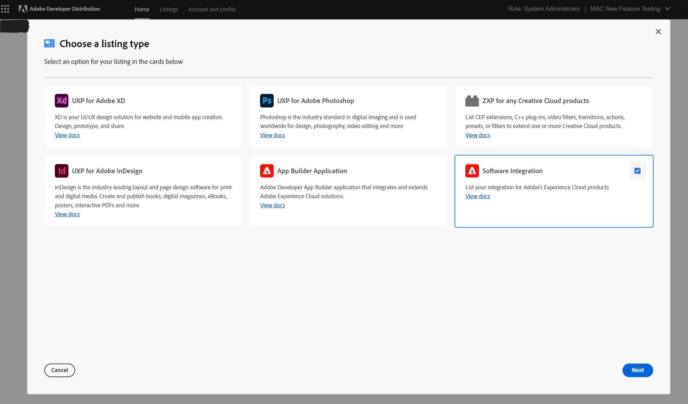

In order to create a software integration listing for Adobe’s Digital Experience products, the developer must have a sandbox Enterprise org associated with their Adobe login. All Technology Partner Program members get a sandbox enterprise org assigned upon approved registration. Attempting to create a software integration listing without joining Technology Partner Program will result in the access denied screens as below:

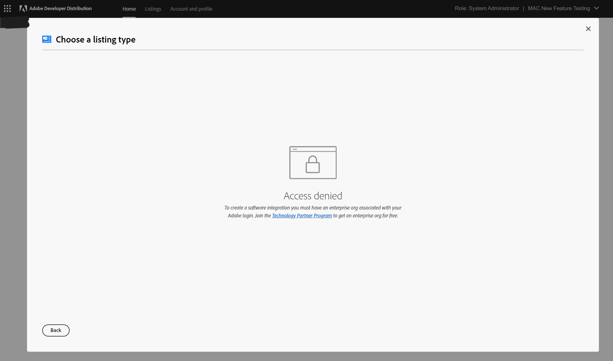

Once the listing type has been chosen, another modal will ask the developer to choose the Developer Console project they want to be associated with the listing. The developer can either choose an existing project or create the listing in a new project.

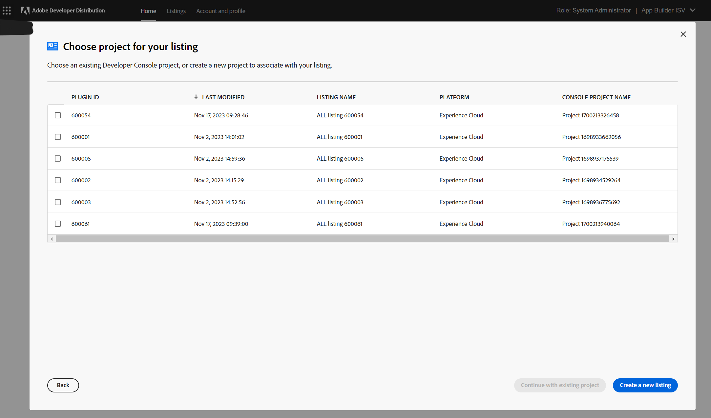

Upon successful creation of the listing, the developer will be routed to the "Listing Overview" page. This page provides a high-level overview of the listing, such as its status, products it integrates with, listing type, distribution type (private/public), last modified date, app ID, and next steps.

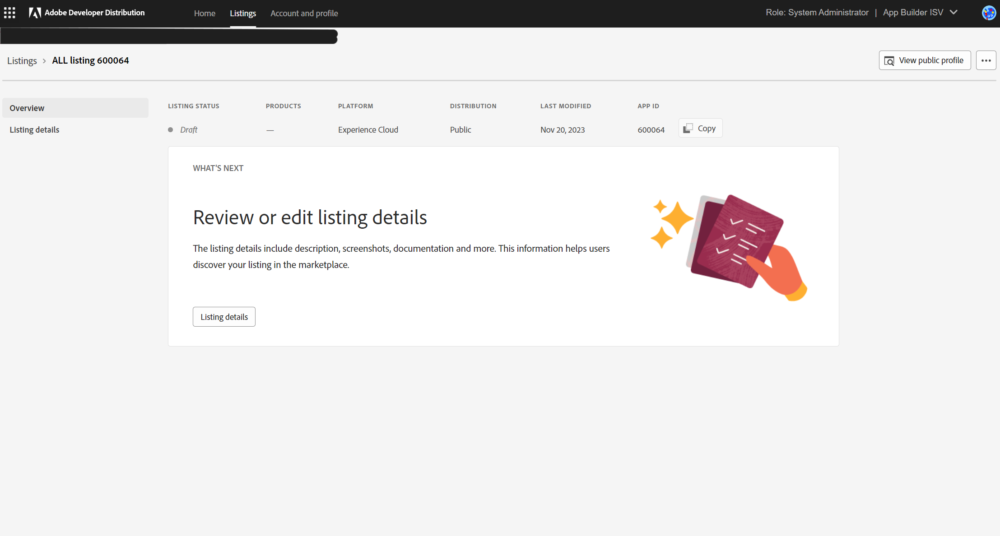

The developer can navigate to the “Listing details” page to add listing-level metadata details that help users discover their listing in the marketplace once it’s published.

This is the landing page to create a submission. Note the following items:

1.	The navigation panel on the left confirms that this is the Listing Details screen.
2.	The requestor's role and organization name are listed in the upper right-hand corner. If any profile details need to be edited, click the "Edit Public Profile" tab.
3.	The menu at the top of the screen indicates the listing status, products it integrates with, listing type, distribution type (private/public), last modified date and app ID.

The listing details for the app are ready to be added now.

## Listing Details

The developer can submit the new listing metadata in multiple tabs: General, Icons, Media, Products, Tags, and Services. All mandatory fields are marked with an asterisk.

The General tab has the application’s public name, a short description (subtitle), a long description, and support information (email, URL, phone number and information). Be sure to save a draft if you navigate away from the page.

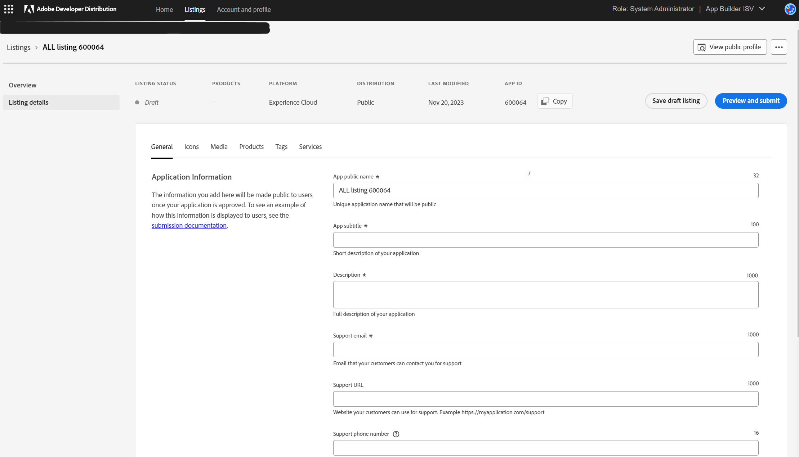

The Icons tab requires three different icon sizes for each integration. Featured image is also required for the published apps that are chosen to be featured on the Exchange marketplace.

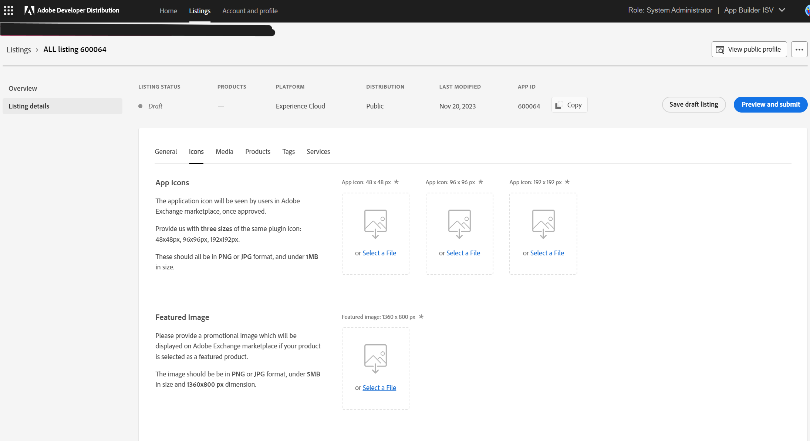

The Media tab has screenshots, videos, documents, and developer references. Up to ten screenshots and up to ten video links can be added and a caption can be added for each screenshot and each video. Up to ten documents and up to ten developer reference materials can be added as a pdf or URL.

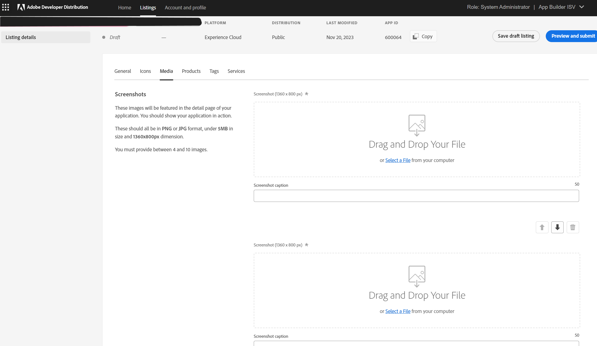

The Products tab has the list of Adobe products that the software integration might support. The developer can choose one or more products as ‘Required’ or ‘Optional’. Required products are the ones that the software integration needs to function properly. Optional products are the ones that the integration supports but doesn't necessarily require.

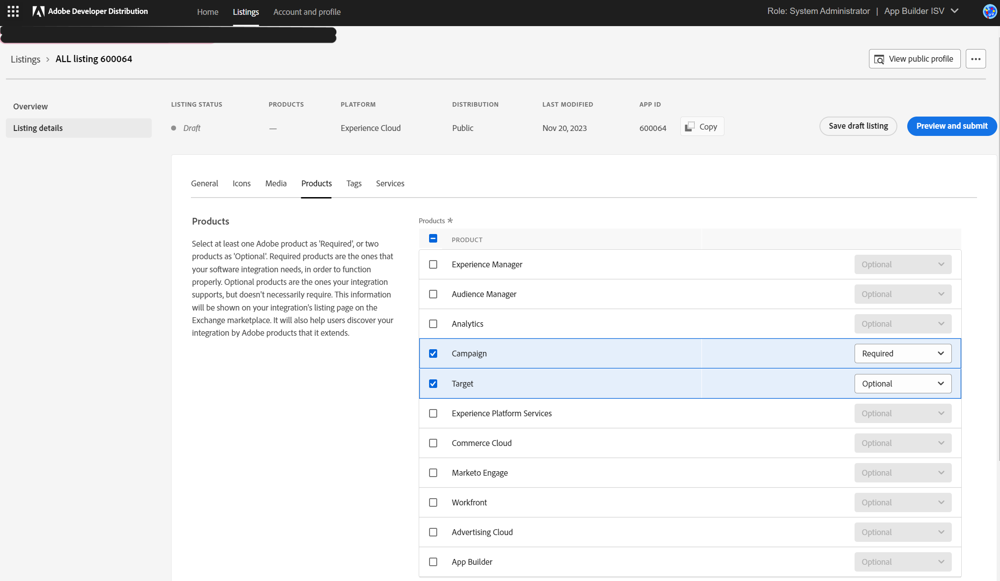

The Tags tab has standard tags, categories (such as Country and Industry), and custom tags that developers can add. These categories and tags help marketplace customers discover and filter/sort software integration app listings published on the marketplace.

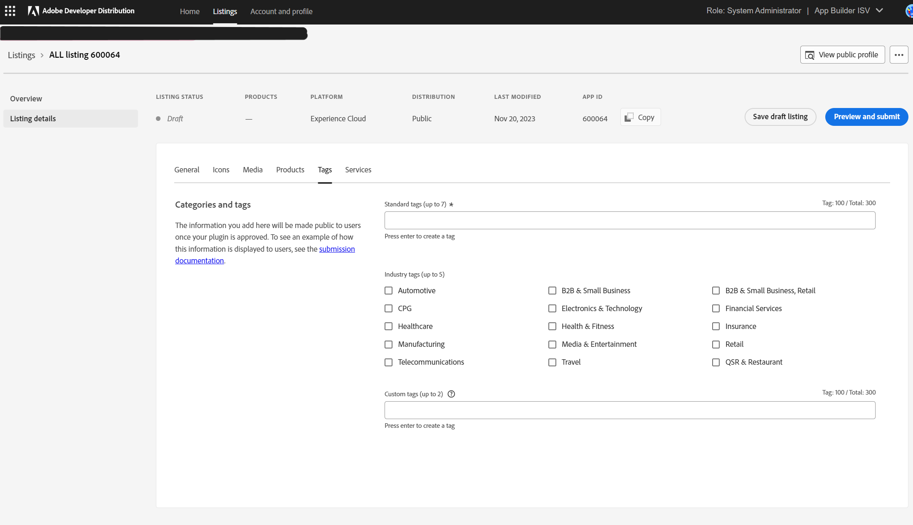

The Services tab is for entering information such as end-user license agreement, installation instructions, version, release notes, and supported languages. The developer can choose an existing template for installation instructions or add a custom one in the URL or PDF format. Version and Release notes are optional fields, since there is no package that the developer needs to upload for the listing. Supported languages are the languages that the application’s in-app UI supports.

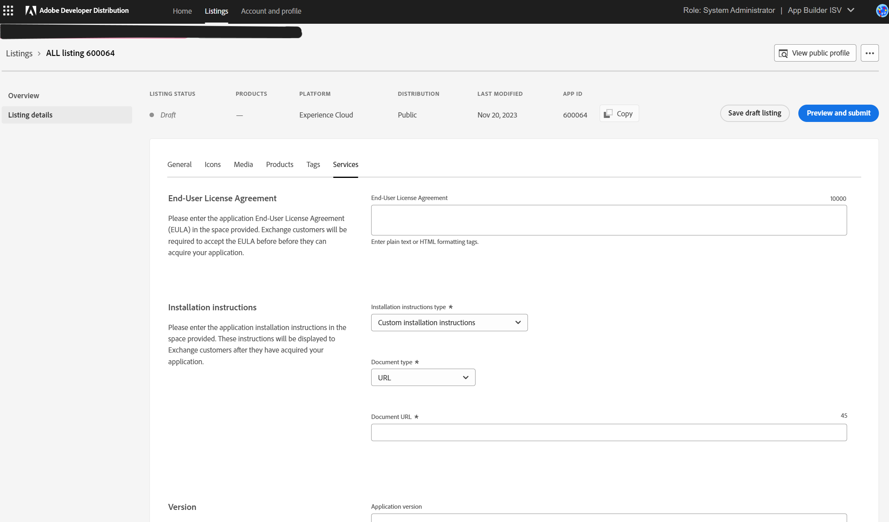
  
When all the mandatory metadata details have been added, clicking the Preview and submit button will open the submission modal. The modal also gives the developer the option to preview the listing or view their public profile.

The developer must provide a note to Adobe reviewers and mark the checkbox for Adobe brand guidelines for the Submit listing button to be enabled.

Delay publishing allows the developer to choose whether they want to publish the initial listing immediately on approval by Adobe, or on a later date.

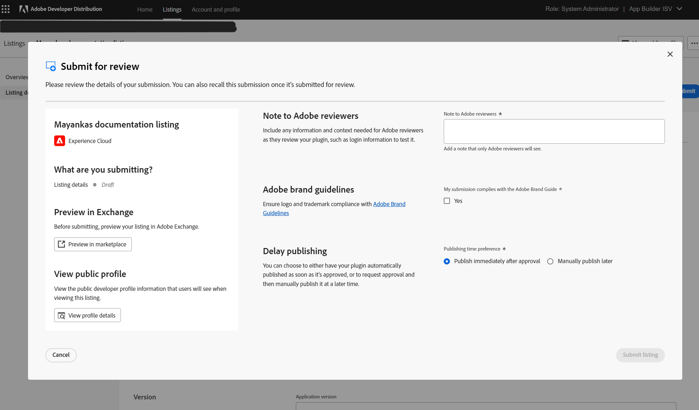
  
Upon successful submission of the listing, the developer is taken to the “Listing Overview” page, where a success message confirms the submission. The status of the Listing changes from draft to “In review."

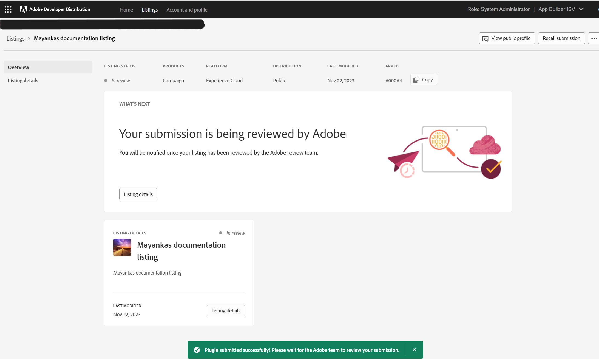

## Reviewing a Submission

When an application has been submitted for review, an Adobe administrator will review the application details. If all the information is complete and the requirements are met, the reviewer will approve the submission. The status of the submission will show a green ‘Approved’ or ‘Published’, depending on what the developer chose as the publishing time preference.

The developer is notified by email when the listing is submitted, and when it has been approved and published on the marketplace.

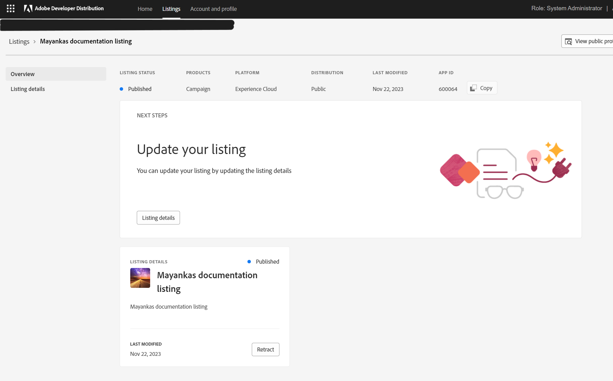

Listing details can be edited on an approved, published, or retracted listing. Metadata edits are highlighted by a yellow outline. The status has an edit suffix.

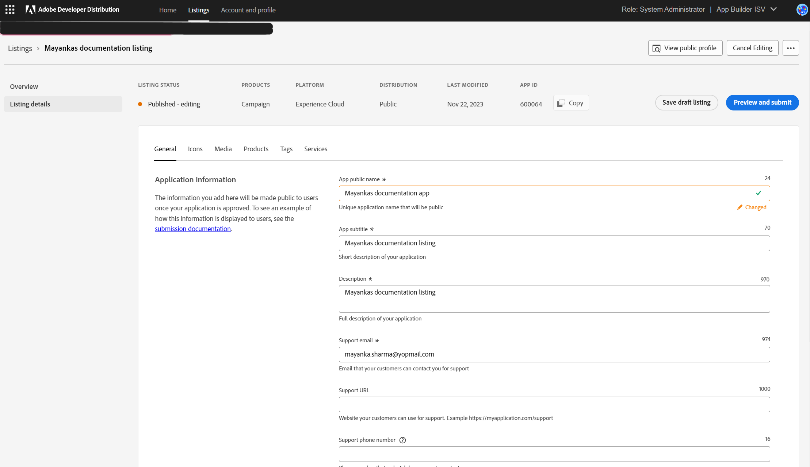

Edits can be submitted for review and will take effect immediately upon approval. Note the edit suffix on the submission modal and the fact that “Delayed publishing” is disabled for metadata changes to a published listing.

